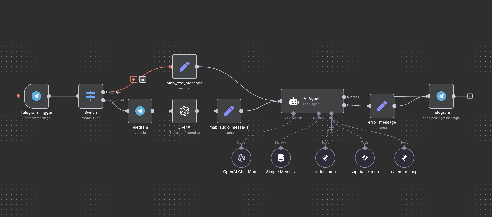
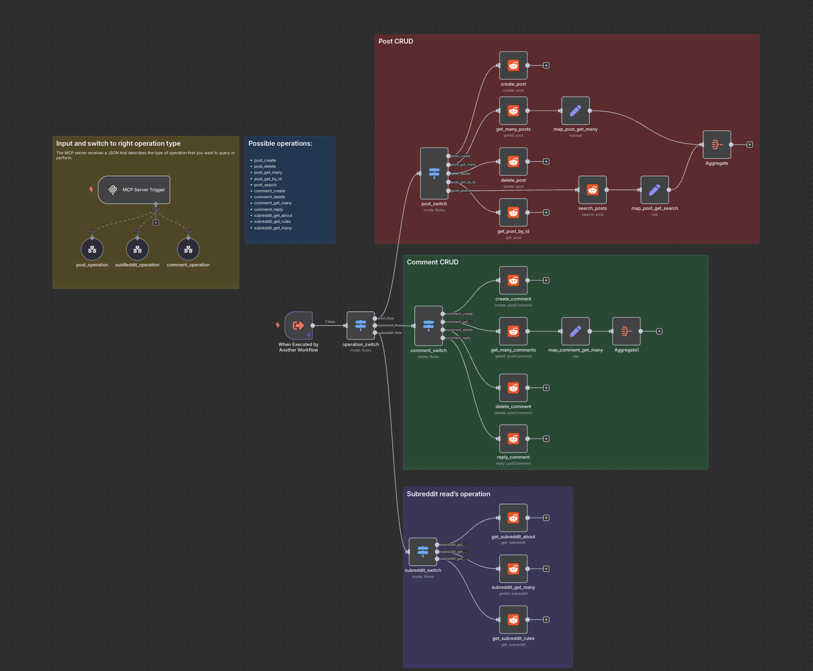
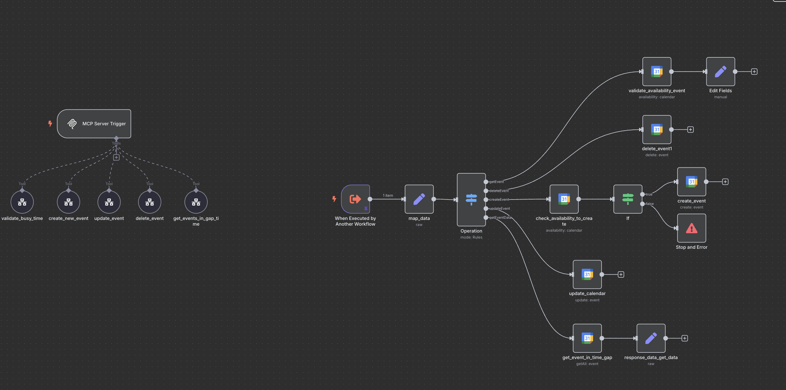
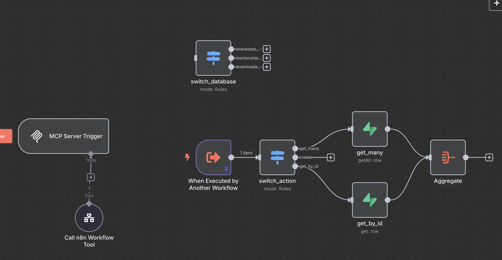

# AI Agent Personal Assistant with MCP Integration

## 🚀 About the Author, Course & Mentorship

**Instructor:** Simeon Aldana  
**Course:** [AI Agent with n8n for Beginners – Full Course & Resources](https://simeon-s-site-a58b.thinkific.com/enroll/3410007?price_id=4322550)  
**Mentorship:** [AI Crafter Mentorship – 1:1 and group mentorship to build your first real AI Agent](https://simeon.cover-io.com/)  
- Weekly 1:1 sessions, async support, and a step-by-step roadmap from idea to launch.
- Real automation tools, hands-on guidance, and working examples.
- [Apply for mentorship here](https://simeon.cover-io.com/)
- [Enroll in the full course here](https://simeon-s-site-a58b.thinkific.com/enroll/3410007?price_id=4322550)

**Watch the full build and explanation on YouTube:**  
[](https://youtu.be/Eur483Oh-Fc?si=eHZ_yBbmvkGCaMjQ)

---

## Main Workflow Overview

Below is the main workflow for the Personal AI Agent, showing how Telegram messages (text or audio) are processed, routed through the AI Agent, and how the agent interacts with various MCP modules (Reddit, Supabase, Google Calendar):



---

## Overview

This project demonstrates a comprehensive AI Agent that acts as a personal assistant, utilizing Telegram as the primary trigger interface. The agent is empowered with three different MCP (Model Context Protocol) integrations that enable operations with Reddit, Google Calendar, and Supabase.

## Architecture

The system follows a modular architecture where each MCP handles specific domain operations:

```
Telegram Bot → AI Agent → AI Agent → Specific MCP (Reddit/Calendar/Supabase)
```

## Available Integrations

### 1. Telegram (Primary Trigger)

Telegram serves as the main user interface. Through a configured bot, users can interact with the agent to send commands, make queries, or execute tasks. The bot receives messages and responds through the AI agent.

**Features:**
- Natural language processing
- Command interpretation
- Response generation
- Multi-user support

### 2. Reddit MCP

The Reddit MCP module enables comprehensive Reddit operations through a structured API interface.

**Available Operations:**
- **Post Management:**
  - Create new posts
  - Delete existing posts
  - Get posts by ID
  - Search posts by keyword
  - Get multiple posts with filters

- **Comment Operations:**
  - Create comments on posts
  - Reply to existing comments
  - Delete comments
  - Retrieve comments from posts

- **Subreddit Information:**
  - Get subreddit details
  - Retrieve subreddit rules
  - Search subreddits

**Workflow File:** [`mcp_reddit.json`](./mcp_reddit.json)
**Visual Guide:** 

### 3. Google Calendar MCP

The Google Calendar MCP provides full calendar management capabilities.

**Available Operations:**
- **Event Management:**
  - Create new calendar events
  - Update existing events
  - Delete events
  - Get event details

- **Availability Checking:**
  - Validate time slot availability
  - Check for conflicts
  - Get events within time ranges

- **Smart Scheduling:**
  - Automatic conflict detection
  - Time zone handling
  - Event validation before creation

**Workflow File:** [`mcp_google_calendar.json`](./mcp_google_calendar.json)
**Visual Guide:** 

### 4. Supabase MCP

The Supabase MCP enables database operations for personal brand management and data storage.

**Available Operations:**
- **Data Retrieval:**
  - Get records by ID
  - Retrieve multiple records with limits
  - Filter and search data

- **Supported Tables:**
  - `course_waitlist` - Users waiting to enroll in courses
  - `downloadable_resources` - Files and materials for download
  - `downloads` - Download event logs with timestamps
  - `interested_users` - Users interested in products/courses
  - `mentorship_requests` - Incoming mentorship requests

**Workflow File:** [`mcp_supabase.json`](./mcp_supabase.json)
**Visual Guide:** 

## Main Personal Assistant Workflow

The core personal assistant workflow orchestrates all MCP interactions:

**Workflow File:** [`personal_assistant.json`](./personal_assistant.json)

This workflow:
- Receives Telegram messages
- Processes natural language through AI
- Routes requests to appropriate MCPs
- Returns formatted responses to users

## Configuration Requirements

### Required Credentials

| Service | Required Credentials |
|---------|---------------------|
| **Telegram** | Bot Token from @BotFather |
| **OpenAI** | API Key for natural language processing |
| **Reddit MCP** | Reddit API credentials (Client ID, Client Secret, User Agent) |
| **Google Calendar MCP** | Google Calendar API credentials and associated Google account |
| **Supabase MCP** | Supabase project URL and API Key |

### Security Considerations

- Store all credentials securely
- Never commit credentials to version control
- Use environment variables for sensitive data
- Regularly rotate API keys
- Implement proper access controls

## Usage Examples

### Reddit Operations
```
User: "Find the top 5 posts in r/n8n"
Agent: Routes to Reddit MCP → Returns formatted post list
```

### Calendar Operations
```
User: "Schedule a meeting tomorrow at 2 PM for 1 hour"
Agent: Routes to Calendar MCP → Checks availability → Creates event
```

### Database Operations
```
User: "Show me all mentorship requests from this week"
Agent: Routes to Supabase MCP → Queries database → Returns results
```

## Scalability Features

### Modular Design
- Each MCP operates independently
- Easy to add new MCP integrations
- Configurable routing logic
- Extensible workflow structure

### Extensibility
- Add new MCPs for different services
- Expand existing MCP functionality
- Customize response formatting
- Implement additional AI capabilities

### Performance
- Asynchronous processing
- Efficient data handling
- Optimized API calls
- Caching mechanisms

## Technical Implementation

### Workflow Structure
Each MCP workflow follows a consistent pattern:
1. **Trigger Node** - Receives requests
2. **Switch Node** - Routes to specific operations
3. **Action Nodes** - Execute API calls
4. **Response Nodes** - Format and return data

### Error Handling
- Graceful failure management
- User-friendly error messages
- Retry mechanisms
- Logging and monitoring

### Data Flow
1. User sends message via Telegram
2. AI processes natural language
3. Request routed to appropriate MCP
4. MCP executes operation
5. Response formatted and returned
6. User receives result via Telegram

## Getting Started

1. **Import Workflows** - Import all JSON files into your n8n instance
2. **Configure Credentials** - Set up all required API credentials
3. **Deploy MCPs** - Ensure all MCP servers are running
4. **Test Integration** - Verify each MCP connection
5. **Activate Workflows** - Enable the main personal assistant workflow

## Support and Maintenance

- Regular workflow monitoring
- API rate limit management
- Credential rotation
- Performance optimization
- Feature updates and enhancements

---

*This AI Agent demonstrates the power of combining multiple MCPs to create a comprehensive personal assistant that can handle diverse tasks across different platforms and services.*