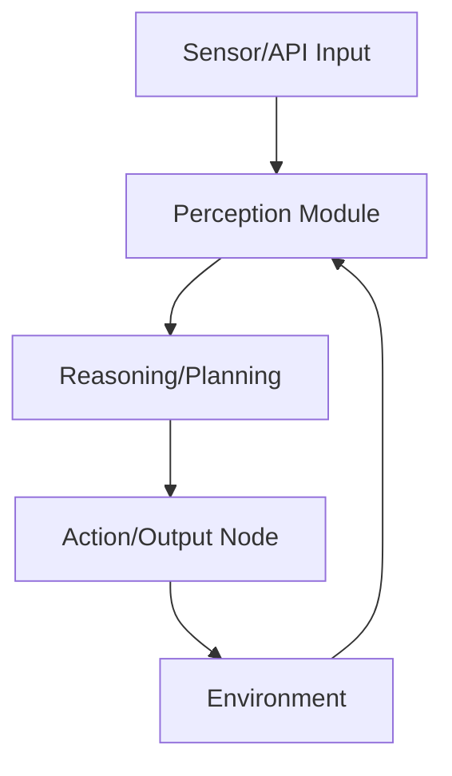

# What is an AI Agent?

## Classic Definition
A classic definition by Stuart Russell and Peter Norvig states:
> "An agent is a persistent computational system capable of acting autonomously to achieve its objectives or goals, when situated in an environment."

In other words, an agent receives perceptions from its environment and produces actions in response, continuously and unpredictably altering that environment. Agents can exist in diverse settings—from the physical world to operating systems or the web. The crucial aspect is the perception/action interaction with their environment. Every agent has an architecture that organizes its internal components (information modules, possible operations, action control, etc.), even in the simplest agents.

## Key Property: Autonomy
A fundamental property of agents is autonomy. An agent operates without direct human intervention while controlling its own internal states and decisions. Generally, autonomy means "self-control": the agent acts on our behalf but independently, initiating and adjusting its actions based on its perception and history, rather than being teleoperated step by step. This growing autonomy distinguishes AI agents from static software programs, making them active entities capable of handling unexpected situations once properly configured.

---

## Types of AI Agents
Understanding the categories of agents helps you apply them to different problems, from basic automation to complex planning tasks:

### 1. **Reactive Agents (Simple Reflex Agents)**
- Operate on a perceive-and-react principle, with no internal state or memory of past events.
- Example: A thermostat that turns on heating when it detects low temperature, or a basic chess bot that chooses the next optimal move based only on the current board state.
- **Strength:** Fast response.
- **Limitation:** No long-term planning.

### 2. **Deliberative Agents (Model-Based Agents)**
- Maintain an internal model of the world and can plan ahead.
- Consider past experiences or predictive models to decide actions.
- Example: A navigation agent that uses historical and predictive data (traffic, weather) to plan the optimal route.
- **Strength:** Flexible, can reason about "what if" scenarios.

### 3. **Goal-Based Agents**
- Specialized deliberative agents focused on achieving specific goals.
- Decide actions by evaluating which bring them closer to the desired objective.
- Example: A chess program simulating future moves to checkmate the opponent.
- **Strength:** Adaptable strategies as situations change.

### 4. **Utility-Based Agents**
- Go beyond goal achievement by considering how satisfactorily a goal is reached.
- Assign a utility or value to each possible world state and choose actions that maximize expected utility.
- Example: A product recommendation system that not only suggests relevant options but maximizes user satisfaction based on preferences and history.
- **Strength:** Balances multiple objectives and trade-offs.

### 5. **Learning Agents**
- Improve performance through experience.
- Use machine learning techniques (neural networks, reinforcement learning, etc.) to adapt strategies.
- Example: AlphaGo, which learned to play Go at a superhuman level through self-play and feedback.
- **Strength:** Can handle new situations and refine behavior over time.

### 6. **Hybrid Agents**
- Combine elements of reactive, deliberative, and learning agents to leverage their strengths.
- Often organized in layers: some handle fast reactions, others perform deeper planning.
- Example: An autonomous car that brakes instantly for obstacles (reaction) while also planning the most efficient route (deliberation).
- **Strength:** Can switch between reflexive and planned responses as needed.

### 7. **Multi-Agent Systems (MAS)**
- Environments with multiple agents interacting.
- Agents collaborate (or compete) in a shared environment to achieve goals, often ones that a single agent could not accomplish alone.
- Example: In logistics, several agents manage different parts of the supply chain, communicating to adjust plans.
- **Strengths:** Fault tolerance, scalability, division of labor.
- **Challenge:** Coordination and communication between agents.

---

## Essential Components of an Agent
Despite their diversity, all agents share certain fundamental components in their architecture:

### 1. **Perception (Sensors)**
- Captures information from the agent's environment.
- Can be physical (cameras, microphones, sensors in robots) or virtual (APIs, database reads, user input in software).
- The quality and scope of perception define how aware the agent is of its world.

### 2. **Reasoning (Decision-Making)**
- The "brain" of the agent, where perceptions are processed, internal state is maintained, and actions are decided.
- Algorithms or models (e.g., symbolic logic, neural networks, language models like GPT) implement the agent's decision logic.
- May involve rule-based inference, if-then conditions, or advanced planning.

### 3. **Planning**
- Key subcomponent for deliberative agents.
- Breaks down complex goals into manageable subtasks and establishes a sequence of steps.
- Example: A planning agent analyzes available information, prioritizes objectives, and creates an adaptive plan.

### 4. **Memory**
- Stores relevant information for the agent.
- Can be short-term (recent conversation context) or long-term (learned knowledge, historical data).
- Enables coherence over time, learning from past successes and failures.
- Example: A conversational agent remembers user preferences; a robot recalls past experiences to avoid repeating mistakes.

### 5. **Action (Actuators)**
- The ability to intervene in and change the environment.
- In physical agents: motors, robotic arms, electrical signals.
- In software agents: API calls, sending messages, writing files.
- Actions can directly or indirectly modify the environment.

### 6. **Environment**
- The medium in which the agent operates, from which it receives perceptions and to which it sends actions.
- Can be physical (the real world) or virtual (simulations, the internet, operating systems).
- Properties of the environment (observable, deterministic, dynamic, etc.) greatly affect agent design.
- In multi-agent systems, the environment is shared, and one agent's actions may become another's perceptions.

---

## Modern Context: AI Agents in Practice
Today, AI agents are at the core of many real-world applications:
- **Conversational AI:** Chatbots and virtual assistants that remember context and adapt to user needs.
- **Automation:** Agents that monitor systems, trigger workflows, and optimize business processes.
- **Robotics:** Autonomous vehicles, drones, and industrial robots.
- **Recommendation Systems:** Agents that personalize content and product suggestions.
- **Multi-Agent Collaboration:** Distributed systems in logistics, finance, and smart grids.

### Example: AI Agent in an Automated Workflow (n8n)

---

## Key Takeaways
- **AI agents** are autonomous systems that perceive, reason, plan, remember, and act within an environment.
- They range from simple reflex agents to complex, learning, and multi-agent systems.
- Their architecture and capabilities determine their suitability for different tasks—from automation to advanced decision-making.
- Modern AI agents are foundational to the next generation of intelligent, adaptive, and scalable solutions.