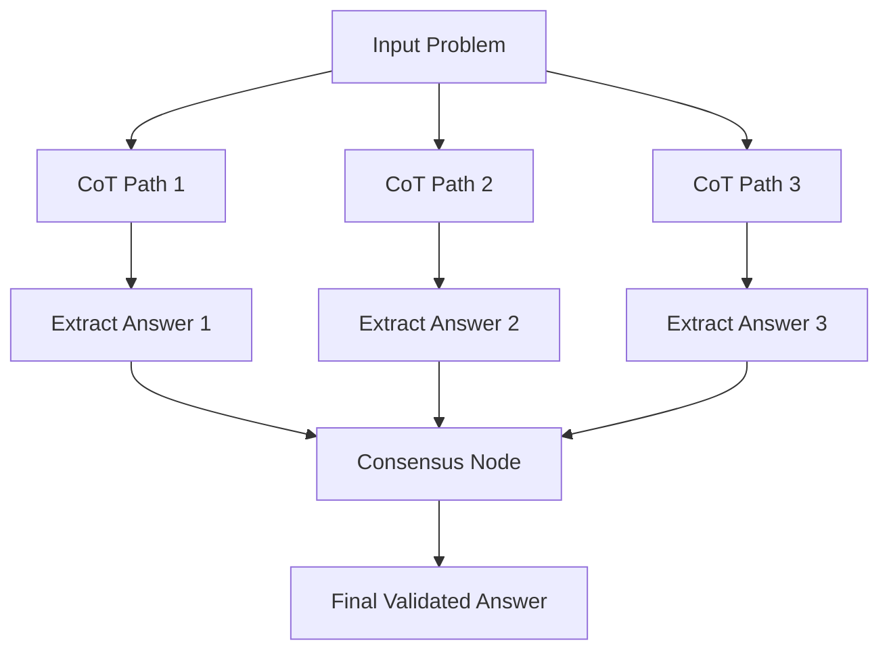

# Chain-of-Thought (CoT) Prompts

## Overview

The Chain-of-Thought (CoT) technique deserves special mention. It consists of inducing the model to generate intermediate reasoning steps before giving a final answer. It is, in part, an extension of reasoning prompts, but has been specifically researched as a technique to improve performance on complex problems (mathematical, logical, multi-step).

In production contexts, we can use CoT in two ways:
1. **Within a single prompt**: For the model to "think out loud" and then respond
2. **Distributed across multiple nodes/calls**: Each solving a sub-problem (manual prompt chaining)

**Key Research Finding:** Adding the phrase "Let's think step by step:" within the prompt was the original discovery that improves many models' capacity to solve problems by forcing them to break down the task.

---

## Characteristics and Best Practices

### **1. Instruct the Model to Think Step by Step**
A simple way is to add the phrase "Let's think step by step:" within the prompt.

**Examples:**
```
Is the number 17 prime? Let's think step by step.
```

```
Analyze the problem step by step before giving the final answer.
```

The model will enumerate divisions, calculations, etc., before answering, improving accuracy significantly.

### **2. Clearly Separate Reflection from Final Answer**
A common pattern is to ask the model to mark its "thoughts" and then its "answer."

**Structured CoT Format:**
```
First, show your reasoning. Then give only the short final answer on a new line, prefixed with 'Answer:'.
```

**Internal CoT (Hidden Reasoning):**
```
Think through this step by step internally, then provide only the final answer.
```

This way we get both the thought chain and the result, or improve accuracy without showing reasoning.

### **3. Few-Shot CoT**
For complex problems, we can include an example in the prompt explicitly showing how step-by-step reasoning is done.

**Example Template:**
```
Problem: [description]
Thinking: First I check X... Then Y... Finally I conclude Z.
Answer: [Z]

Now solve this new problem:
Problem: [new problem]
```

Combined with few-shots, chain-of-thought has been shown to improve models' capacity for tasks requiring logic.

### **4. Multi-Node Implementation in N8N**
While CoT usually refers to within the same prompt, in automation we can recreate the effect in a sequence of nodes.

**Chained Request Pattern:**
```
Node 1 (LLM): Extract and summarize relevant data
↓
Node 2 (LLM): Analyze the summarized data  
↓
Node 3 (LLM): Generate final response
```

This approach aligns with CoT philosophy: divide the problem into manageable parts with predictable outputs.

---

## Applied Example: Refund Request Analysis

Suppose an AI agent reviews customer refund requests and decides whether to approve them. This is a process with multiple conditions (Defective product? Within warranty? Evidence attached? etc.). We want the AI to analyze each condition before the final decision for greater reliability.

### **Input Data**
- **Customer Request**: Purchase details, refund reason, date, etc.
- **Company Policies**: Return policies and conditions

### **Chain-of-Thought Prompt**

```
You are a financial bot that approves or rejects refund requests following company policies.

Relevant Policy (summary): Customers can request refunds within 30 days if the product arrived defective or wasn't as described. After 30 days, only store credit is given, not cash refunds.

Customer Request: 
"""
I bought a monitor on September 15th and it turned out to have a line of dead pixels. I request a full refund. — Submitted October 10th.
"""

**Let's think step by step:**
1. Verify purchase date vs request date (within 30 days?)
2. Check reason (defective product?)
3. Apply policy to determine refund type
4. Decide approval or not, given the conditions

Now, perform the analysis:
```

### **Expected Output**

```
1. Purchase date Sep 15th and request Oct 10th: ~25 days have passed, within 30 days.
2. Reason: defective product (dead pixel line) – falls under defective product category.
3. Policy: Within 30 days and defective product => full refund in original payment method applies.
4. Decision: **Approve full refund**.

Answer: Your refund request has been approved. You will receive the full refund through the same payment method in the coming days.
```

### **Analysis of the Output**
Here we clearly see the enumerated chain of thought (steps 1-4) followed by the decision and a formulated final response. This level of breakdown helps ensure no condition is missed.

We can programmatically inspect those steps if desired (for example, parsing the text and verifying that in step 1 it calculated the days correctly, adding double verification in critical cases).

---

## Advanced CoT Techniques

### **Tree of Thoughts (ToT)**
Extension of CoT that explores multiple reasoning paths simultaneously.

```
Explore three different approaches to solve this problem:

Approach A: [reasoning path A]
Approach B: [reasoning path B]  
Approach C: [reasoning path C]

Compare the approaches and select the best solution:
```

### **Self-Consistency CoT**
Generate multiple reasoning chains and take the majority answer.

```javascript
// N8N Function node for self-consistency
const responses = [
  $input.item(0).json.response1,
  $input.item(1).json.response2,
  $input.item(2).json.response3
];

// Extract final answers
const answers = responses.map(r => 
  r.match(/Answer:\s*(.*?)$/s)?.[1]?.trim()
);

// Find majority answer
const answerCounts = {};
answers.forEach(answer => {
  answerCounts[answer] = (answerCounts[answer] || 0) + 1;
});

const majorityAnswer = Object.keys(answerCounts).reduce((a, b) => 
  answerCounts[a] > answerCounts[b] ? a : b
);

return [{ json: { majorityAnswer, confidence: answerCounts[majorityAnswer] / answers.length } }];
```

### **Verify-and-Correct CoT**
Add a verification step after reasoning.

```
Step 1: Solve the problem step by step
Step 2: Verify your reasoning by checking each step
Step 3: Correct any errors found
Step 4: Provide the final verified answer
```

---

## N8N Integration Strategies

### **Sequential CoT Implementation**

```javascript
// Function node to extract reasoning steps
const aiResponse = $input.first().json.ai_response;

// Parse reasoning steps
const stepMatches = aiResponse.match(/(\d+\.\s.*?)(?=\d+\.|Answer:|$)/gs);
const steps = stepMatches ? stepMatches.map(step => step.trim()) : [];

// Extract final answer
const finalAnswer = aiResponse.match(/Answer:\s*(.*?)$/s)?.[1]?.trim();

return [{
  json: {
    reasoning_steps: steps,
    final_answer: finalAnswer,
    step_count: steps.length,
    has_complete_reasoning: steps.length >= 3 && finalAnswer
  }
}];
```

### **Validation Node Implementation**

```javascript
// Function node to validate CoT reasoning
const reasoning = $input.first().json;

const validationChecks = {
  // Check if reasoning follows logical sequence
  logicalFlow: reasoning.reasoning_steps.every((step, index) => {
    if (index === 0) return true;
    return step.includes('then') || step.includes('next') || step.includes('therefore');
  }),
  
  // Check if conclusion follows from premises
  supportedConclusion: reasoning.final_answer && 
    reasoning.reasoning_steps.some(step => 
      step.toLowerCase().includes(reasoning.final_answer.toLowerCase().substring(0, 10))
    ),
  
  // Check for consistency
  noContradictions: !reasoning.reasoning_steps.some(step => 
    step.includes('but') && step.includes('however')
  )
};

const isValid = Object.values(validationChecks).every(check => check);

return [{
  json: {
    ...reasoning,
    validation: validationChecks,
    is_valid_reasoning: isValid,
    confidence_score: isValid ? 0.9 : 0.6
  }
}];
```

### **Multi-Path CoT Workflow**



---

## Production Considerations

### **Transparency vs. Performance**
In very advanced models like GPT-4, they sometimes solve correctly without needing explicit CoT, but providing the chain can still be useful for transparency.

**Benefits of Transparency:**
- **Debugging**: Valuable for troubleshooting AI reasoning
- **Trust Building**: Employees can see how AI reached conclusions
- **Auditability**: Critical workflows can store explanations to justify decisions

### **Error Handling in CoT**
⚠️ **Important:** If reasoning is shown, remember that AI can ramble or make errors in those steps (even while reaching the correct conclusion).

**Mitigation Strategies:**
```javascript
// Validation function for mathematical reasoning
function validateCalculations(reasoningText) {
  // Extract mathematical expressions
  const mathExpressions = reasoningText.match(/\d+\s*[+\-*/]\s*\d+\s*=\s*\d+/g);
  
  if (!mathExpressions) return true;
  
  return mathExpressions.every(expr => {
    const [calculation, result] = expr.split('=');
    const actualResult = eval(calculation.trim());
    return actualResult === parseInt(result.trim());
  });
}
```

### **Hybrid AI + Rules Validation**
Advanced integrations combine AI with deterministic rules to validate the chain, though this goes beyond prompt engineering scope.

**Example Pattern:**
```
AI CoT Reasoning → Rule-Based Validation → Final Decision
```

---

## Best Practices Summary

### **When to Use CoT**
✅ **Complex multi-step problems**  
✅ **Mathematical or logical reasoning**  
✅ **Decision-making with multiple criteria**  
✅ **When transparency is required**  
✅ **To improve accuracy on challenging tasks**

### **When to Avoid CoT**
❌ **Simple classification tasks**  
❌ **When speed is critical**  
❌ **For straightforward extraction**  
❌ **When reasoning steps aren't relevant**

### **Model Performance Considerations**
- **Older/smaller models**: CoT shows significant improvement
- **Advanced models (GPT-4)**: Improvement is smaller but transparency remains valuable
- **Domain-specific tasks**: Few-shot CoT often works better than zero-shot

---

## Key Benefits

✅ **Improved Accuracy**: Step-by-step breakdown reduces errors  
✅ **Transparency**: Shows reasoning process for auditability  
✅ **Debugging**: Easier to identify where reasoning goes wrong  
✅ **Trust Building**: Users can follow the AI's logic  
✅ **Quality Control**: Intermediate steps can be validated  
✅ **Educational Value**: Demonstrates problem-solving approach

---

## Advanced Applications

### **Legal Document Analysis**
```
Analyze this contract clause step by step:
1. Identify the key obligations
2. Determine the parties responsible
3. Check for ambiguous language
4. Assess potential risks
5. Provide recommendation
```

### **Medical Symptom Assessment**
```
Evaluate the patient symptoms systematically:
1. List all reported symptoms
2. Group related symptoms
3. Consider differential diagnoses
4. Assess severity indicators
5. Recommend next steps
```

### **Financial Risk Assessment**
```
Analyze the investment opportunity:
1. Evaluate market conditions
2. Assess company fundamentals
3. Calculate risk metrics
4. Compare to benchmarks
5. Provide investment recommendation
```

In CoT, especially when using older models or those with less reasoning capacity, this "think out loud" approach significantly increases precision. The technique has proven valuable for production systems requiring both accuracy and explainability.